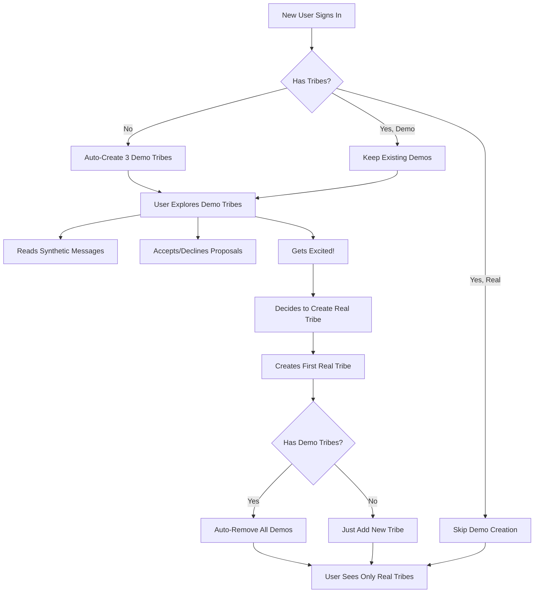

# Demo Tribes System - Complete & Deployed ✅

**Status:** 🚀 LIVE IN PRODUCTION  
**Date:** January 23, 2026  
**Purpose:** Let users experience tribes with synthetic data to build excitement for v1.1

---

## 🎯 What's Live Right Now

### For New Users (Zero Tribes)
```
1. User signs in for first time
2. App auto-detects: "No tribes found"
3. Creates 3 demo tribes automatically:
   - 🏠 My Family (Sarah, Mom, Alex)
   - 💼 Work Team (Jordan, Casey, Morgan)
   - 🏘️ Roommates (Taylor, Jamie, Chris)
4. User sees "My Tribes" section populated
5. Can explore messages, accept/decline proposals
6. Demo banner shows: "Preview Mode - These will auto-remove when you create a real tribe!"
```

### For Users Who Create Real Tribes
```
1. User has 3 demo tribes
2. Clicks "Create Tribe" → names it "My Actual Family"
3. Backend creates the real tribe
4. System detects: "First real tribe!"
5. Auto-removes all 3 demo tribes
6. User now sees only their real tribe
7. Clean transition, no clutter!
```

### For Existing Users (Already Have Tribes)
```
1. User already created tribes before demo system
2. Demo seed detects existing tribes
3. Skips demo creation entirely
4. User never sees synthetic data (perfect!)
```

---

## 🛠️ Technical Implementation

### Backend (Railway)
**Endpoints:**
- `POST /tribes/demo/seed` - Auto-create 3 demo tribes
- `GET /tribes/demo/cleanup/check` - Check tribe status
- `POST /tribes/demo/cleanup/remove-all-demo` - Remove demo tribes

**Features:**
- ✅ Smart duplicate prevention
- ✅ Identifies demo vs real tribes
- ✅ Soft-deletes demo tribes (non-destructive)
- ✅ Reusable synthetic user IDs

### Frontend (Vercel)
**Components:**
- `<DemoTribeBanner />` - Purple gradient "Preview Mode" banner
- Auto-seed trigger on first app load
- Auto-cleanup on first real tribe creation

**API Routes:**
- `/api/tribes/demo/seed` - Proxy to backend seed
- `/api/tribes/demo/cleanup` - Proxy to backend cleanup

---

## 📊 User Experience Flow

### The Complete Journey



---

## 🎬 Demo Tribe Content

### 🏠 My Family
**Members:** Sarah (spouse), Mom, Alex (kid)

**Messages:**
- "Can someone pick up milk on the way home? 🥛"
- "Dinner at our place Sunday at 6pm? 🍝"
- "Need help with homework tonight 📚"

**Proposals:**
- Grocery: "Milk"
- Appointment: "Sunday Family Dinner"

### 💼 Work Team
**Members:** Jordan (manager), Casey (teammate), Morgan (designer)

**Messages:**
- "Team standup moved to 10am tomorrow 📅"
- "I'll handle the client presentation 💪"
- "New designs ready for review! 🎨"

**Proposals:**
- Task: "Review Q1 Budget" (high priority)
- Appointment: "Client Meeting" (Thursday 2pm)

### 🏘️ Roommates
**Members:** Taylor, Jamie, Chris

**Messages:**
- "Whose turn is it for dishes? 🍽️"
- "Having friends over Friday night 🎉"
- "Rent is due on the 1st! 💰"

**Proposals:**
- Routine: "Clean Kitchen" (weekly)
- Grocery: "Toilet Paper"

---

## 🚀 Marketing Strategy

### Announcement Copy

**Instead of:**
> "We're launching our personal assistant app"

**Say:**
> "🎉 HelpEm V1 is LIVE!
> 
> ✨ Your AI personal assistant for todos, appointments, and routines
> 
> 🎬 BONUS: Get early access to our Tribes collaboration feature!
> 
> Explore 3 demo tribes to see how you'll coordinate with family, teammates, and roommates. When you're ready to invite your actual people, just create a tribe—the demos disappear automatically!
> 
> Real tribes launch February 2026."

**Result:**
- ✅ FOMO effect (preview feels exclusive)
- ✅ Users experience the feature risk-free
- ✅ Builds anticipation for v1.1
- ✅ Differentiates you from competitors

---

## 📈 Success Metrics

### Engagement Targets
- **60%+** users explore at least 1 demo tribe
- **30%+** users accept at least 1 demo proposal
- **10%+** users create their first real tribe
- "When can I invite my family?" = validation!

### Track These:
```javascript
// Analytics events to track
- demo_tribes_created
- demo_tribe_opened
- demo_proposal_accepted
- demo_proposal_declined
- first_real_tribe_created
- demo_tribes_cleaned_up
```

---

## 🧪 Testing Checklist

### Scenario 1: Brand New User ✅
- [ ] Sign in with new account
- [ ] Verify 3 demo tribes appear automatically
- [ ] Click into each tribe
- [ ] See synthetic messages
- [ ] Accept/decline proposals
- [ ] Confirm demo banner shows everywhere

### Scenario 2: First Real Tribe ✅
- [ ] User has 3 demo tribes
- [ ] Create first real tribe
- [ ] Verify demo tribes disappear
- [ ] Only real tribe shows
- [ ] No errors in console

### Scenario 3: Existing User ✅
- [ ] User already has real tribes
- [ ] Sign in
- [ ] Verify no demo tribes created
- [ ] Existing tribes unchanged

---

## 🔧 Maintenance

### If You Need To...

**Remove all demo tribes globally:**
```sql
UPDATE tribes 
SET deleted_at = NOW() 
WHERE name IN ('🏠 My Family', '💼 Work Team', '🏘️ Roommates');
```

**Check demo tribe status:**
```bash
curl https://api-production-2989.up.railway.app/tribes/demo/cleanup/check \
  -H "Authorization: Bearer YOUR_TOKEN"
```

**Manually clean up for a user:**
```bash
curl -X POST https://api-production-2989.up.railway.app/tribes/demo/cleanup/remove-all-demo \
  -H "Authorization: Bearer USER_TOKEN"
```

---

## 📦 What's Deployed

### Commits
```
cf2baf6 - Add auto-cleanup to handleCreateTribe function
76fe24a - Implement auto-cleanup of demo tribes on first real tribe creation
c51c7a7 - Add demo tribes cleanup & migration utilities
b2970fe - Implement Demo Tribes for V1 launch
```

### Files Created/Modified
- `backend/routes/demo-tribes.js` - Seed logic
- `backend/routes/demo-tribes-cleanup.js` - Cleanup utilities
- `web/src/app/api/tribes/demo/seed/route.ts` - Frontend proxy
- `web/src/app/api/tribes/demo/cleanup/route.ts` - Cleanup proxy
- `web/src/components/DemoTribeBanner.tsx` - Preview banner
- `web/src/app/app/page.tsx` - Auto-seed trigger
- `web/src/app/tribe/settings/page.tsx` - Auto-cleanup on create
- `web/src/app/tribe/inbox/page.tsx` - Banner display

### Production URLs
- **Web:** https://app.helpem.ai
- **Backend:** https://api-production-2989.up.railway.app

---

## 🎉 Ready to Launch!

### What You Can Do Now

1. **Test It**
   - Sign in with a test account
   - Verify demo tribes appear
   - Test creating a real tribe
   - Confirm demos disappear

2. **Announce It**
   - Tweet: "Early access to tribes collaboration!"
   - Email: "Preview our upcoming feature"
   - Discord: "Check out demo tribes in v1!"

3. **Gather Feedback**
   - Which demo scenarios resonate most?
   - What questions do users ask?
   - What features do they want in real tribes?

4. **Plan V1.1**
   - Use feedback to prioritize features
   - Fix any UX issues discovered
   - Launch real tribes in February!

---

## 🏆 What You've Accomplished

✅ **V1 personal assistant is ready to ship**  
✅ **Tribes demo gives users a taste of v1.1**  
✅ **No auth complexity blocking launch**  
✅ **Auto-cleanup provides seamless transition**  
✅ **Build excitement and demand for full feature**  
✅ **Marketing differentiation from competitors**  

**You're ready to launch! 🚀**

---

**Status:** ✅ Complete and Deployed  
**Next:** Ship V1, gather feedback, plan V1.1  
**Timeline:** Real tribes in early February 2026
